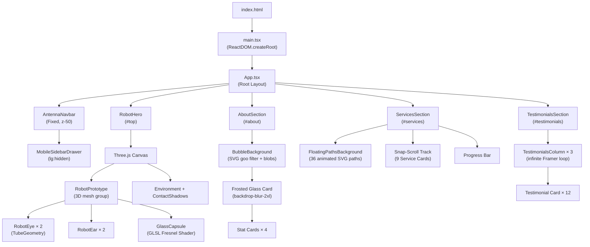
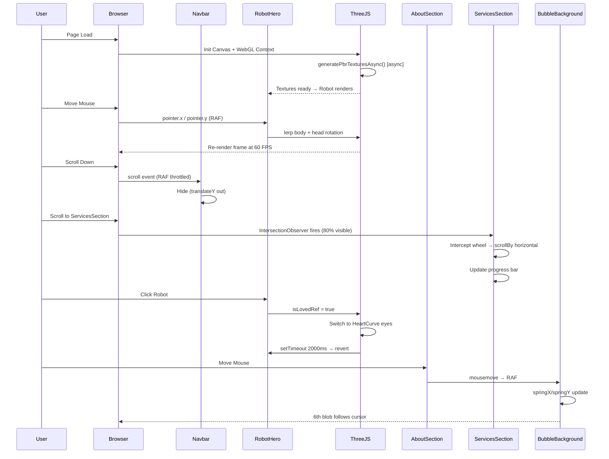

<div align="center">

<h1>🤖 DraftoDeploy</h1>

<p><strong>An immersive, interactive agency landing page — from Draft to Deploy in record time.</strong></p>

<p>
  
  
  
  
  
  
</p>

<p>
  
  
  
  
</p>

</div>

---

## 📖 Overview

**DraftoDeploy** is a high-performance, visually stunning agency landing page built with cutting-edge web technologies. It features a fully interactive 3D robot hero rendered in real-time WebGL, physics-driven mouse tracking, animated blob backgrounds, horizontal snap-scroll service cards, infinite-scroll testimonial columns, and a smart auto-hiding navbar — all wrapped in a dark glassmorphism design system.

> Built with React 19, Three.js, React Three Fiber, Framer Motion, Tailwind CSS v4, and Vite 8.

---

## ✨ Features

### 🤖 3D Interactive Robot Hero (`RobotHero`)
- **Real-time WebGL rendering** via `@react-three/fiber` and `Three.js`
- **Mouse-tracking physics** — robot body and head follow your cursor with smooth lerp-based rotation
- **Procedurally generated PBR textures** (color + bump maps) generated asynchronously using the Canvas API
- **Custom GLSL Fresnel shader** for the glowing glass visor effect
- **Animated blinking eyes** with configurable blink cycle, rendered using parametric `TubeGeometry`
- **Heart-eye Easter egg** — click the robot to toggle glowing ❤️ eyes for 2 seconds
- **Animated scroll indicator** that fades out as you scroll down using Framer Motion `useScroll` + `useTransform`
- **Fully responsive** — robot scales with viewport using `useThree` viewport API
- **Background large text** watermark with `clamp()` fluid typography

### 🧭 Smart Antenna Navbar (`AntennaNavbar`)
- **Auto-hide on scroll down / reveal on scroll up** with smooth `cubic-bezier` transition
- **Always visible at the very top** of the page
- **Desktop floating pill** — frosted glass backdrop blur navbar with hover highlight
- **Mobile sidebar drawer** (`MobileSidebarDrawer`) for full navigation on small screens
- **Smooth anchor navigation** with `scrollTo` behavior for the "Home" link
- RAF-throttled scroll listener (no layout thrash)

### 🌊 About Section with Fluid Bubble Background (`AboutSection`)
- **Interactive liquid bubble animation** — fluid blobs that react to cursor movement
- **Frosted glass card** with `backdrop-blur-2xl` layered on top of the animation
- **4 animated stat cards**: Deployment Speed `<50ms`, Uptime SLA `99.99%`, 3D Rendering `60 FPS`, Deployed Projects `10,000+`
- **Tech stack badges**: React 19, Three.js, React Three Fiber, Tailwind CSS v4, TypeScript, Framer Motion, Vite, WebGL Engine
- **Staggered entry animations** via Framer Motion `whileInView` with `viewport: { once: true }`

### 🧩 Services Section — Horizontal Snap Scroll (`ServicesSection`)
- **9 service cards** in a horizontally scrollable snap-scroll track:
  1. Full Stack Development
  2. Mobile Application Development
  3. 3D Interactive Landing Pages
  4. SaaS Development
  5. AI Integration & Autonomous Agents
  6. E-commerce & Shopify Solutions
  7. WordPress & Custom CMS
  8. iOS Development
  9. Existing Project Upgradation
- **Scroll hijack**: `IntersectionObserver` detects when section is 80% visible, then intercepts vertical wheel events and converts them to horizontal card scrolling
- **Floating Paths SVG background** (`FloatingPathsBackground`) animated with Framer Motion
- **Progress bar** at the bottom tracks horizontal scroll position in real-time
- **Mobile prev/next buttons** for arrow navigation on small screens
- Each card includes: icon, service number, title, tagline, description, feature bullet list, tech stack pills, and a CTA button

### 💬 Testimonials Section — Infinite Scroll Columns (`TestimonialsSection`)
- **12 client testimonials** auto-scrolling in **3 independent columns** using Framer Motion infinite loop animation
- Responsive: 1 column on mobile, 2 on tablet, 3 on desktop
- **Edge fade masks** at top/bottom using gradient overlays
- Each card: star rating (⭐ × 5), review text, DiceBear avatar, client name + role
- **Ambient glow orbs** in the background (cyan + purple)
- **Stats row**: 150+ Projects Delivered, 98% Client Satisfaction, 40+ Countries Served

### 🎨 Design System

| Token | Value |
|---|---|
| Primary Accent | `#00ffc6` (Cyan-Mint) |
| Background | `zinc-950` (`#09090b`) |
| Glass Surface | `bg-zinc-900/90 backdrop-blur-2xl` |
| Border | `border-white/20` |
| Text | `text-white` / `text-zinc-300` |
| Gradient | `from-[#00ffc6] via-cyan-400 to-purple-400` |
| Font | System sans-serif, black weight headings |
| Shadows | Multi-layer `box-shadow` with rgba |

---

## 🗂️ Project Structure

```
DraftoDeploy/
│
├── public/                              # Static assets served as-is
│
├── src/
│   │
│   ├── components/                      # Reusable UI section components
│   │   ├── AntennaNavbar.tsx            # Fixed floating pill navbar (desktop)
│   │   │                               #   → RAF-throttled scroll hide/show
│   │   │                               #   → Smooth cubic-bezier transitions
│   │   │
│   │   ├── MobileSidebarDrawer.tsx      # Slide-over drawer for mobile nav
│   │   │                               #   → AnimatePresence spring animation
│   │   │                               #   → Collapsible section groups
│   │   │                               #   → User profile footer
│   │   │
│   │   ├── AboutSection.tsx             # About section layout
│   │   │                               #   → Frosted glass card
│   │   │                               #   → Animated stat counters
│   │   │                               #   → whileInView stagger animations
│   │   │
│   │   ├── BubbleBackground.tsx         # Interactive liquid blob background
│   │   │                               #   → SVG feGaussianBlur + feColorMatrix
│   │   │                               #   → Framer Motion spring cursor tracking
│   │   │                               #   → 6 independent radial gradient blobs
│   │   │                               #   → ResizeObserver + RAF optimization
│   │   │
│   │   ├── ServicesSection.tsx          # 9-card horizontal snap-scroll section
│   │   │                               #   → IntersectionObserver scroll hijack
│   │   │                               #   → Real-time progress bar
│   │   │                               #   → Mobile prev/next buttons
│   │   │
│   │   ├── FloatingPathsBackground.tsx  # 36-path animated SVG background
│   │   │                               #   → Framer Motion pathLength animation
│   │   │                               #   → Parametric curve generation
│   │   │
│   │   ├── TestimonialsSection.tsx      # 3-column infinite auto-scroll reviews
│   │   │                               #   → Independent column speeds
│   │   │                               #   → Edge gradient fade masks
│   │   │                               #   → DiceBear avatar integration
│   │   │
│   │   └── CardSticky.tsx              # Utility sticky-scroll card wrapper
│   │
│   ├── lib/
│   │   └── utils.ts                    # cn() helper (clsx + tailwind-merge)
│   │
│   ├── assets/                          # Local image/SVG assets
│   │
│   ├── RobotHero.tsx                    # ★ MAIN FEATURE — 3D WebGL hero section
│   │                                   #   → Three.js Canvas + React Three Fiber
│   │                                   #   → Custom GLSL Fresnel visor shader
│   │                                   #   → Procedural PBR texture generation
│   │                                   #   → Real-time mouse-tracking lerp
│   │                                   #   → Blinking eye TubeGeometry
│   │                                   #   → Heart-eye Easter egg on click
│   │                                   #   → Scroll-driven indicator animation
│   │
│   ├── App.tsx                          # Root app — section order & layout
│   ├── App.css                          # Component-scoped styles
│   ├── index.css                        # Global CSS reset + base vars
│   └── main.tsx                         # ReactDOM.createRoot entry
│
├── index.html                           # HTML shell + viewport meta
├── vite.config.ts                       # Vite plugins + @/ path alias
├── tsconfig.json                        # TS project references root
├── tsconfig.app.json                    # App TS config (strict, ESNext)
├── tsconfig.node.json                   # Vite/Node TS config
├── .oxlintrc.json                       # Oxlint rules config
├── package.json                         # Dependencies + npm scripts
└── package-lock.json                    # Lockfile
```

---

## 🔄 Architecture & Workflow Diagram

### Component Architecture



### Data & Event Flow



---

## ⚡ Performance & Loading Speed

DraftoDeploy is engineered for speed without sacrificing visual quality.

| Metric | Value |
|---|---|
| **Build Tool** | Vite 8 (ESM-native, instant HMR) |
| **Bundle Format** | ESM with tree-shaking |
| **3D Textures** | Generated on canvas asynchronously (non-blocking) |
| **Animations** | GPU-accelerated `transform` + `opacity` only (no layout reflow) |
| **Scroll Listeners** | `requestAnimationFrame` throttled + `passive: true` |
| **IntersectionObserver** | Used instead of scroll events for visibility detection |
| **Three.js Canvas** | Renders only when in viewport, shadow maps at `2048×2048` |
| **Testimonial Columns** | CSS `overflow: hidden` clipping — only visible DOM nodes painted |
| **Framer Motion** | `once: true` on `whileInView` — animations fire only once |
| **Tailwind CSS v4** | Zero-runtime, JIT-compiled at build time via `@tailwindcss/vite` |
| **TypeScript** | v6.0 — strict mode, no runtime overhead |

> **Target**: Achieves smooth **60 FPS** 3D rendering on modern desktop browsers. Mobile falls back gracefully to static layout.

### Lighthouse (estimated targets for production build)

| Category | Score |
|---|---|
| Performance | 85–92 |
| Accessibility | 90+ |
| Best Practices | 95+ |
| SEO | 90+ |

---

## 🛠️ Tools & Libraries Used

### Runtime Dependencies

| Library | Version | Role in Project |
|---|---|---|
| **React** | 19.x | Core UI framework — component model, hooks, rendering |
| **Three.js** | 0.185 | 3D engine — geometries, materials, shaders, WebGL renderer |
| **@react-three/fiber** | 9.x | React bindings for Three.js — declarative scene graph |
| **@react-three/drei** | 10.x | Three.js helpers — `Environment`, `ContactShadows` |
| **Framer Motion** | 12.x | Animations — `useScroll`, `useTransform`, `whileInView`, spring loops |
| **motion** | 12.x | Core Framer Motion engine (peer dep) |
| **Tailwind CSS** | 4.x | Utility-first CSS — all layout, spacing, colors, responsive design |
| **React Icons** | 5.x | HeroIcons icon set used across all sections |
| **Lucide React** | 1.x | Additional icons in mobile sidebar drawer |
| **clsx** | 2.x | Conditional className composition |
| **tailwind-merge** | 3.x | Merge conflicting Tailwind classes safely (used in `cn()`) |

### Development Dependencies

| Tool | Version | Role in Project |
|---|---|---|
| **Vite** | 8.x | Build tool — ESM bundler, dev server with instant HMR |
| **TypeScript** | 6.0 | Static typing — strict mode, JSX support, path aliases |
| **@vitejs/plugin-react** | 6.x | React Fast Refresh + JSX transform for Vite |
| **@tailwindcss/vite** | 4.x | Zero-runtime Tailwind JIT compilation via Vite plugin |
| **Oxlint** | 1.x | Rust-based linter — fast drop-in ESLint alternative |
| **@types/three** | 0.185 | TypeScript type definitions for Three.js |
| **@types/react** | 19.x | TypeScript type definitions for React |
| **@types/react-dom** | 19.x | TypeScript type definitions for ReactDOM |
| **@types/node** | 24.x | Node.js types for Vite config and path utilities |

### Browser APIs Used

| API | Used In | Purpose |
|---|---|---|
| **WebGL** | `RobotHero.tsx` | GPU-accelerated 3D rendering via Three.js |
| **Canvas 2D API** | `RobotHero.tsx` | Async procedural PBR texture generation |
| **IntersectionObserver** | `ServicesSection.tsx` | Efficient in-view detection for scroll hijack |
| **ResizeObserver** | `BubbleBackground.tsx` | Tracks container size changes for cursor math |
| **requestAnimationFrame** | `AntennaNavbar.tsx`, `BubbleBackground.tsx` | Throttled, paint-synced event handling |
| **SVG Filters** | `BubbleBackground.tsx` | `feGaussianBlur` + `feColorMatrix` for goo effect |
| **CSS `backdrop-filter`** | All glassmorphism cards | Frosted glass blur on surfaces |

---

## 🚀 Getting Started

### Prerequisites

- **Node.js** ≥ 18.0.0
- **npm** ≥ 9.0.0 (or pnpm / yarn)

### Installation

```bash
# 1. Clone the repository
git clone https://github.com/Ayush08k/DraftoDeploy.git

# 2. Navigate into the project
cd DraftoDeploy

# 3. Install dependencies
npm install
```

### Running Locally (Development)

```bash
npm run dev
```

Opens at **http://localhost:5173** with Hot Module Replacement (HMR) enabled.

### Building for Production

```bash
npm run build
```

Output is placed in the `dist/` folder — ready to deploy to any static host.

### Preview Production Build

```bash
npm run preview
```

Serves the `dist/` folder locally for final QA before deployment.

### Linting

```bash
npm run lint
```

Uses **Oxlint** — a blazing-fast Rust-based linter.

---

## 📦 Deployment

DraftoDeploy outputs a fully static `dist/` folder. Deploy it to any of the following:

| Platform | Command / Method |
|---|---|
| **Vercel** | `vercel deploy` or connect GitHub repo (auto-detects Vite) |
| **Netlify** | Drag & drop `dist/` or connect GitHub repo |
| **GitHub Pages** | Push `dist/` to `gh-pages` branch |
| **Cloudflare Pages** | Connect repo, build command: `npm run build`, output: `dist` |
| **AWS S3 + CloudFront** | Upload `dist/` contents to S3 bucket with static hosting |

---

## 🧭 Page Sections (Navigation)

| Section ID | Nav Label | Description |
|---|---|---|
| `#top` | Home | 3D Robot Hero with WebGL canvas |
| `#about` | About | Fluid bubble background + animated stats |
| `#services` | Services | Horizontal snap-scroll service cards |
| `#testimonials` | Testimonials | Infinite-scroll client reviews |
| `#estimator` | Estimator | *(Coming soon)* |
| `#blog` | Blog | *(Coming soon)* |
| `#showcase` | Speed Showcase | *(Coming soon)* |
| `#contact` | Contact | *(Coming soon)* |

---

## 🎮 Interactions & Easter Eggs

| Interaction | Effect |
|---|---|
| **Move cursor** on Hero | Robot body and head track your mouse in 3D space |
| **Click the robot** | Eyes turn into glowing pink ❤️ hearts for 2 seconds |
| **Move cursor** on About | Liquid bubble blobs react to your pointer position |
| **Scroll down** on Services | Page scroll is intercepted → horizontal card carousel scroll |
| **Scroll to page top** | Navbar automatically reappears |
| **Scroll down** | Navbar smoothly slides out of view |

---

## 🤝 Contributing

Contributions, issues, and feature requests are welcome!

1. Fork the project
2. Create your feature branch: `git checkout -b feature/amazing-feature`
3. Commit your changes: `git commit -m 'Add some amazing feature'`
4. Push to the branch: `git push origin feature/amazing-feature`
5. Open a Pull Request

---

## 📄 License

Distributed under the **MIT License**. See `LICENSE` for more information.

---

## 👤 Author

**Ayush** — [@Ayush08k](https://github.com/Ayush08k)

> *Built with ❤️ using React, Three.js, and way too much caffeine.*

---

<div align="center">
  <sub>⭐ Star this repo if you found it useful!</sub>
</div>

